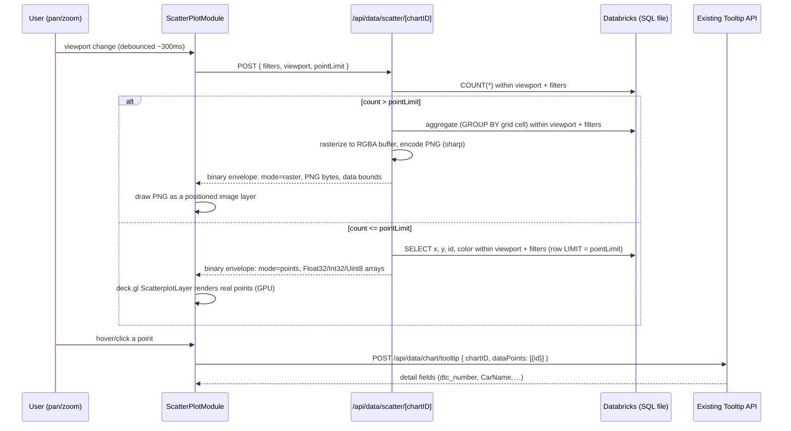

# ScatterPlotModule plan

## Goal

Create a new module at `modules/ScatterPlotModule/` that follows the same contract as
the other modules (`index.tsx`, `chartDataSchema.ts`, `chartType.d.ts`,
`instructions.md`) and can render **scatterplots with up to 1,000,000+ points**
without loading that many rows into the browser as JSON.

Principle (server decides, client renders):

```
raw table (millions of rows)
        ↓
current viewport (x/y range) + active dashboard filters
        ↓
server counts matching rows
        ↓
count > point limit  →  server aggregates/rasterizes → PNG image
count <= point limit  →  server sends compact binary points → deck.gl/WebGL
```

Default point limit: **500,000**, changeable by the user for the current browser
session only (no persistence), via a plain number input inside the module.

This module is **generic**: no DTC-specific field names anywhere in module code.
The DTC table is only used as the **test/reference data source** (mock dataset +
later manual SQL wiring), exactly like any other module is wired via
`pagesConfig/*.json` + `pagesConfig/sql/*.sql`.

---

## Decisions from the Q&A

- **New dependency:** add `deck.gl` (`@deck.gl/core`, `@deck.gl/react`,
  `@deck.gl/layers`). No basemap/Mapbox token needed — this is a plain 2D data
  plot, not a geographic map, so we use deck.gl's `OrthographicView`, not the
  `MapView` that `MapModule`-style tools would use.
- **Aggregated view format:** the server renders an actual **PNG image**
  (not just a bin-count grid left to the client). This needs one new
  image-encoding dependency. Plan: add `sharp` — it encodes a raw RGBA pixel
  buffer we build in plain JS (binning + color blending) straight to PNG; it
  does not need a drawing/canvas API, has prebuilt binaries for common
  platforms, and is a much lighter addition than `canvas`/`node-canvas`
  (which needs native Cairo build tooling). This is flagged here for explicit
  sign-off since it's a new native dependency.
- **Reference data source (for mock data + later real SQL):** table
  `lsb_partitioned_dtcdata_2021024_sofa_gold`
  (`pagesConfig/schemas/dtc-table.json`):
  - `X` → `OdometerRead` (int)
  - `Y` → `FrequencyCount` (int)
  - `color` → `IsActive` / `IsStored` (int, values `0` or `-1`)
  - point id → `DTCDataId` (bigint)
  - detail-only fields (loaded on demand, not in the bulk payload) →
    `dtc_number`, `CarName`, `ECUName`, `SymptomName`, `ErrorText`
- **Session point-limit control:** a plain number input (shadcn `Input`,
  `type="number"`), rendered directly inside the module (not a global
  dashboard setting). Local component state only, reset on reload.
  Raising it above the default 500,000 shows a short, non-blocking warning
  about potential performance impact. The app must not refuse to honor a
  higher value the user explicitly set.

---

## High-level data flow



Zoom/pan never fetches directly on every pixel of movement: view-state changes
are debounced and prior in-flight requests are aborted, mirroring the existing
pattern in `stores/tooltip.ts` (`lodash.debounce` + `AbortController`).

---

## Dependencies to add

| Package                                              | Why                                                                                                                                            |
| ---------------------------------------------------- | ---------------------------------------------------------------------------------------------------------------------------------------------- |
| `@deck.gl/core`, `@deck.gl/react`, `@deck.gl/layers` | WebGL rendering of real points, viewport/camera handling, picking. Used with `OrthographicView` (plain 2D axes), no basemap.                   |
| `sharp`                                              | Encodes the server-side aggregated RGBA buffer into a PNG response. Only used in the new API route (server-side, never bundled to the client). |

No changes to `recharts`, `visx`, `d3-*` usage elsewhere — unrelated to this module.

---

## Framework changes required (small, generic, flagged explicitly)

The existing chart-loading model (`ChartWrapper` → `useQuery` →
`POST /api/data/chart/<chartID>` → full JSON array validated against the
module's Zod schema) assumes the **entire result set for the current filters**
is small enough to send as JSON once per filter change. That is incompatible
with a 1,000,000+ row scatterplot, so this module cannot use it for its bulk
data. Two small, generic (not scatter-specific) additions to `ChartWrapper`
are needed:

1. **Opt-out of the standard fetch.** Add an optional `selfFetching?: boolean`
   field to `TabsComponentConfig` (`types/tabs.d.ts`). When `true`,
   `ChartWrapper`'s existing `useQuery` for `chartData` is disabled
   (`enabled: !selfFetching && parsedMockData === undefined && hasApplied`),
   and the idle/"before Apply" placeholder is skipped for that chart — the
   module owns its own loading/empty states entirely. This is additive and
   defaults to `false`/unset for every existing module, so no other module's
   behavior changes.
2. **Expose the already-resolved filter parameters.** `ChartWrapper` already
   computes a `params: Record<string, string | number | null>` object from
   `filterBindings` for its own fetch. Inject this as a new
   `filterParams` prop on `ChartWrapperInjectedProps` so a self-fetching
   module can include the same dashboard filter values in its own requests.
   This is useful for any future self-fetching module, not just this one.

No changes are needed to `modulRegistry.ts`, `generateModuleRegistry.ts`, or
`validateModules.ts` — `selfFetching` lives in dashboard JSON /
`TabsComponentConfig`, not in the module registry, so the module contract and
its generation/validation scripts stay untouched.

`hasApplied` / Apply-gating, filter dimensions, connections, and the
enhanced-tooltip/context-menu framework behavior are all reused unchanged.

---

## New API route

`app/api/data/scatter/[chartID]/route.ts` (new, next to the existing
`app/api/data/chart/` and `app/api/data/filters/` routes).

### Request

```ts
POST /api/data/scatter/<chartID>
{
  filters: Record<string, string | number | null>; // same shape ChartWrapper already builds
  viewport: { xMin: number; xMax: number; yMin: number; yMax: number };
  pointLimit: number;   // the user's current session value
  imageSize: { width: number; height: number }; // raster target size in device pixels
}
```

Server-side validation (OWASP-relevant, independent of the client-set
`pointLimit`):

- `viewport` bounds and `pointLimit` must be finite numbers; non-finite/absurd
  values are rejected with `400`.
- `imageSize` is clamped to a hard maximum (e.g. 4096×4096) regardless of what
  the client sends, to prevent memory exhaustion from a malformed/hostile
  request — this is a safety ceiling, not the user-visible "point limit" UX
  the user controls.
- `pointLimit` has no _upper_ UX restriction per the requirements, but the
  route still enforces an absolute hard ceiling (configurable server
  constant, e.g. 5,000,000) purely as a last-resort guard against accidental
  denial-of-service; this should be high enough to never matter in normal
  use.
- `chartID` is resolved to a SQL file the same way the existing chart route
  does (`path.resolve` + startsWith check against the SQL directory).

### Response

A single small binary envelope for both modes, so the client always does one
`fetch(...).arrayBuffer()` and branches on a mode byte:

```
[ "SCP1" magic (4 bytes) ]
[ mode: u8 ]                 // 0 = points, 1 = raster
[ reserved: u8 x 3 ]          // alignment padding
[ dataBounds: f32 x4 ]        // xMin, xMax, yMin, yMax actually covered
[ totalCount: u32 ]           // matching rows in the viewport (for UI/debug)
-- mode 0 (points), then: --
[ pointCount: u32 ]
[ x: f32 x pointCount ]
[ y: f32 x pointCount ]
[ id: f64 x pointCount ]      // f64 so bigint ids up to 2^53 round-trip safely
[ color: u8 x pointCount ]    // small enum/category index, palette mapping is config-driven
-- mode 1 (raster), then: --
[ pngByteLength: u32 ]
[ png: u8 x pngByteLength ]   // ready-to-display PNG, positioned via dataBounds
```

### SQL contract (reuses the existing per-chart SQL convention)

`pagesConfig/sql/<chartID>.sql` for a `ScatterPlotModule` chart must be a
`SELECT` that already applies the dashboard's normal `:namedParam` filter
bindings (same mechanism as every other chart) and aliases its output to
exactly:

```sql
SELECT
  OdometerRead AS x,
  FrequencyCount AS y,
  DTCDataId AS id,
  IsActive AS color
FROM ...
WHERE ...  -- existing :param filter bindings
```

The API route wraps this file as a CTE and appends, generically (no
knowledge of the underlying table):

- a `COUNT(*)` pass with an additional `x BETWEEN :vpXMin AND :vpXMax AND y
BETWEEN :vpYMin AND :vpYMax` viewport filter,
- then either a `GROUP BY` grid-cell aggregation (raster path) or a plain
  row `SELECT ... LIMIT :pointLimit` (points path), using the same
  `runQuery` helper (`app/api/warehouse/connection`) already used by the
  existing chart route.

This mirrors how tooltip SQL is a second, related file per chart — here the
"related file" is the same base file, wrapped generically because the
column names are standardized (`x`, `y`, `id`, `color`) by contract instead
of arbitrary per-chart aliases.

### Point details (hover/click) — fully reused, no new endpoint

Detail fields are **not** part of the bulk payload. On hover/click, the
module calls the existing tooltip mechanism exactly like other modules do:

```ts
fetchTooltipData(chartID, [{ id: hoveredId }]);
// -> POST /api/data/chart/tooltip
// -> reads pagesConfig/sql/tooltipSql/<chartID>.tooltip.sql
```

`pagesConfig/sql/tooltipSql/<chartID>.tooltip.sql` for this module returns
`dtc_number, CarName, ECUName, SymptomName, ErrorText` (or whatever fields
are relevant later) looked up by the batched `id` array — identical
mechanism to every other module's enhanced tooltip.

---

## Module files

### `chartDataSchema.ts`

Describes one logical point (used for typing `selectedRows` /
`onSelectionChange`, not for the bulk transport, which is binary):

```ts
import { z } from "zod";

const scatterPlotDataSchema = z.object({
  id: z.number(),
  x: z.number(),
  y: z.number(),
  color: z.number().int().optional(),
});

export type ScatterPlotData = z.infer<typeof scatterPlotDataSchema>;

export default scatterPlotDataSchema;
```

### `chartType.d.ts` (sketch, one type declaration: `ScatterPlotChartConfig`)

```ts
type ScatterPlotChartConfig = {
  xAxis: { label?: string; format: "number" | "compact" };
  yAxis: { label?: string; format: "number" | "compact" };
  pointLimit: {
    default: number; // 500000
    max?: number; // optional soft UI ceiling before the warning text
  };
  points: {
    radiusPixels: number;
    opacity: number;
  };
  raster: {
    dotRadiusPixels: number;
    opacity: number;
  };
  colorMapping?: {
    // maps the compact numeric `color` value from SQL to a display color
    values: { value: number; color: string; label?: string }[];
    defaultColor: string;
  };
};
```

### `index.tsx` responsibilities

- Reads `filterParams` + `chartConfig` + its own `pointLimit` input state.
- Tracks the deck.gl `OrthographicView` view state; on change, debounces
  (300 ms, matching `stores/tooltip.ts`) and aborts the previous in-flight
  request (`AbortController`), then calls the new scatter API route.
- Parses the binary envelope: `mode 0` → builds typed arrays and hands them
  to a deck.gl `ScatterplotLayer`; `mode 1` → creates a `Blob`/object URL
  from the PNG bytes and renders it as a positioned `BitmapLayer` (deck.gl)
  or plain `` sized to `dataBounds`.
- Renders the shadcn number input for the session point limit (local
  `useState`, default from `chartConfig.pointLimit.default`), with inline
  warning text when the value exceeds the default.
- On point hover/click, calls `fetchTooltipData` with the point `id` and
  reuses `useTooltipStore`/`TooltipCard` exactly like other modules
  (`enhancedTooltip` behavior stays owned by `ChartWrapper`/the shared
  tooltip store; the module only reports the point via
  `onSelectionChange`/tooltip trigger, same contract as
  `LineChartModule`/`MapModule`).
- Registers a `LassoAdapter<ScatterPlotData>` (see **Type/contract
  integration** below) whenever discrete points are currently rendered
  (mockData mode, or self-fetching "points" mode); not registered while a
  raster image is shown, since individual points aren't addressable there.

### `instructions.md`

Written following `docs/instructions.template.md`, same as every other
module; documents the binary wire format only informally (implementation
detail), and focuses on the SQL contract (`x`/`y`/`id`/`color` aliases),
config, and behavior — like every other module.

---

## Type/contract integration (existing conventions this module must support)

The module must be a full citizen of the existing shared type contracts, not
just a data-shape/config pair. Concretely, checked against every existing
module (`LineChartModule`, `BarChartModule`, `MapModule`, `TableModule`,
`CardModule`):

- **`BaseChartProps` / `ChartWrapperInjectedProps<ScatterPlotData,
ScatterPlotChartConfig>`** — same generic contract as every module;
  `chartID: TableSchemaKey` (see below), `chartConfig: ScatterPlotChartConfig`,
  `chartData: ScatterPlotData[]`, `isLoading`/`isFetching`/`isError`/`error`.
- **`chartID: TableSchemaKey`** — for a real dashboard entry this module
  follows the exact same registration flow as every other chart: generate an
  id (`npm run pageConfig:generateId`), register the table schema
  (`npm run databricks:tableSchemas -- <chartID> '<table-path>'`), which
  extends `types/schemas.d.ts` and makes `chartID` and `TableColumnNames`
  properly typed. The DTC table (`dtc-table`) is already registered this way
  (see `pagesConfig/schemas/dtc-table.json`) and can be reused directly for
  the later real-SQL wiring step.
- **Selection (`onSelectionChange` / `selectedRows`)** — supported like
  `LineChartModule`/`MapModule`: clicking a rendered point (deck.gl picking)
  calls `onSelectionChange([point])` (additive on modifier-click, matching
  `SelectionChangeOptions.additive`); `ChartWrapper` owns the resulting
  `selectedRows: readonly ScatterPlotData[]`, injected back read-only. The
  module highlights selected points (e.g. distinct color/stroke) exactly like
  other modules highlight selected marks; it does not keep its own selection
  state.
- **Lasso (`LassoController<ScatterPlotData>` / `LassoAdapter`)** — same
  contract as `LineChartModule`/`BarChartModule`: the module registers an
  adapter via `lasso.registerAdapter` while points are addressable.
  `getPlotBounds()` returns the deck.gl canvas's pixel rect (relative to the
  wrapper's interaction surface, like every other adapter). `select(shape)`
  projects each currently-loaded point's data coordinates to screen pixels via
  the deck.gl `OrthographicView`'s viewport (`viewport.project([x, y])`),
  normalizes by the plot bounds exactly like `BarChartModule`'s adapter does,
  and returns the matching `ScatterPlotData[]` — reusing the existing
  `shapeContains`/normalization helpers in `components/ChartWrapper/utils.ts`.
  A rectangular lasso can additionally call `applyZoom`, which — uniquely for
  this module — sets the new data-space viewport directly (rectangle corners
  already are `x`/`y` data values once un-normalized), so lasso-zoom reuses
  the same debounced viewport-fetch path as mouse-wheel/drag zoom instead of
  being a separate visual-only concept.
- **Connections (`ChartConnection` / `expectedColumns: TableColumnNames<...>[]`)**
  — unchanged: resolved by `ChartWrapper` from the tooltip SQL result for
  selected points, exactly like every other module; this module only needs a
  correct `pagesConfig/sql/tooltipSql/<chartID>.tooltip.sql` with the right
  aliases once real SQL is wired.
- **Filter dimensions (`FilterDimension` / `filterBindings`)** — supported
  the same way as every module's SQL-bound filters; the only difference is
  _who_ reads the resolved values: for self-fetching mode the module reads
  the new `filterParams` prop itself (see **Framework changes**) instead of
  `ChartWrapper` passing them straight into a single fetch call. The
  dimension types themselves (`string`, `number`, `dateString`, `dateRange`,
  `select`, `multiselect`, `option`) are unaffected.
- **`mockData` (`TabsComponentConfig.mockData?: unknown[]`)** — fully
  supported and unchanged: when `mockData` is provided, `ChartWrapper`
  validates it against `chartDataSchema` and skips fetching entirely, exactly
  like every other module. This is also how the mock dataset below is wired
  in for testing — **without** needing `selfFetching` or the new API route at
  all; the module renders whatever `chartData` it is given via deck.gl,
  regardless of whether that came from `mockData`, a small real fetch, or (in
  self-fetching mode) the module's own viewport request.

---

## Mock dataset for testing

Per feedback, this does **not** use a generator script/npm command or a
committed binary fixture. Instead it follows the exact existing convention
seen in `app/testPage/page.tsx` / `app/testPageLineChart/page.tsx`: a
component config's `mockData` array, provided directly, no backend involved.

The only adjustment for this module is that 1,000,000 literal objects are not
reasonably hand-written inline in the test page, so the data is **externalized
into its own small module** (not a script, not a build step, not a committed
fixture file) that the test page imports:

- `app/testPageScatter/mockScatterData.ts` — exports a plain function, e.g.
  `generateMockScatterData(count = 500_000): ScatterPlotData[]`, built with
  a small seeded-random loop shaped like the DTC reference table
  (`x` ~ `OdometerRead` range, `y` ~ `FrequencyCount` range, `color` in
  `{0, -1}` ~ `IsActive`/`IsStored`, sequential `id`). Kept in its own file
  purely so `app/testPageScatter/page.tsx` itself stays short and readable,
  matching how other test pages keep their `tabsConfig`/`dashboardConfig`
  readable.
- `app/testPageScatter/page.tsx` — a new manual test harness, structured
  exactly like `app/testPageLineChart/page.tsx` (same `DashboardShell` /
  `ChartPageWrapper` / `tabsConfig` / `dashboardConfig` shape), with one
  `ScatterPlotModule` component whose `mockData` is
  `generateMockScatterData(500_000)`.

This exercises deck.gl rendering, the point-limit input, selection, and the
lasso adapter fully client-side, with no API/DB dependency — before any SQL
or the new scatter API route exist. Because `ChartWrapper` validates
`mockData` against `chartDataSchema` for every module, expect the one-time
validation of 1,000,000 rows to take a noticeable moment on this test page;
that cost is specific to this manual harness and does not apply to the real
self-fetching production path (which never sends 1,000,000 rows to the
browser at once).

---

## Out of scope / explicit follow-ups (not built now)

- Persisting the user's point-limit choice beyond the current session/tab
  (no existing mechanism for this fits a "session-only" requirement, so none
  is added).
- Any basemap/geographic projection — this module's `x`/`y` are arbitrary
  numeric axes, unrelated to `MapModule`.
- Actual SQL wiring against the live `lsb_partitioned_dtcdata_2021024_sofa_gold`
  table and a real dashboard entry, and the new `/api/data/scatter/[chartID]`
  route itself — follow once the module is built and validated against the
  `mockData`-driven test page.

---

## Implementation checklist (for the follow-up build session)

1. Add `deck.gl` (`@deck.gl/core`, `@deck.gl/react`, `@deck.gl/layers`) and
   `sharp` to `package.json`.
2. `types/tabs.d.ts`: add `selfFetching?: boolean` to `TabsComponentConfig`.
3. `types/baseChart.d.ts`: add `filterParams` to `ChartWrapperInjectedProps`.
4. `components/ChartWrapper/index.tsx`: gate the existing `useQuery` with
   `!selfFetching`, skip the pre-Apply idle state for self-fetching modules,
   pass `filterParams: params` through to the module.
5. Build `modules/ScatterPlotModule/` (all four required files), including the
   `LassoAdapter`/selection/connections integration described above.
6. `npm run module:validate` and `npm run module:generateRegistry`.
7. Add `app/testPageScatter/mockScatterData.ts` (mock data generator function)
   and `app/testPageScatter/page.tsx` (test harness using `mockData`); verify
   rendering, selection, lasso, and the point-limit control with zero backend
   involvement.
8. Update `modules/instructions.md` with the new module entry.
9. Only after the above is verified: add
   `app/api/data/scatter/[chartID]/route.ts` (viewport/count/raster/points
   logic + binary envelope encoding), then run
   `npm run pageConfig:generateId` / reuse the existing `dtc-table` schema,
   write `pagesConfig/sql/<chartID>.sql` (+ `.tooltip.sql`) against the real
   DTC table, and wire a real dashboard entry with `selfFetching: true`.
