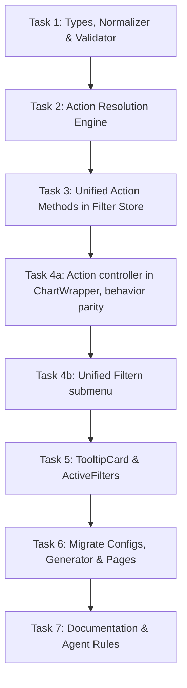

# Unified Chart Interaction & Action Model Implementation Plan

## 1. Context & Goals

Currently, the dashboard framework provides two separate declarative mechanisms for responding to user selections on a chart:
1. **`connections`** (`types/tabs.d.ts`): Filters another chart without navigating. Values are resolved asynchronously via server-side `.tooltip.sql` queries. Target dimensions must be `multiselect`.
2. **`tabJumps`** (`types/tabs.d.ts`): Drills down to another tab and filters that tab, pushing a breadcrumb history. Values are extracted synchronously from client-side row data (`selectedRows`).

While both mechanisms converge into `FilterContribution` entries in `stores/filterProvider.ts`, their configuration schemas, data resolution pipelines, and execution paths in `components/ChartWrapper/index.tsx` are completely bifurcated.

### Problems Solved
- **Cognitive overhead**: Authors are confused about why `connections` don't switch tabs, why `sourceField` means an SQL alias in connections but a client property in tab jumps, and why filtering a sibling chart requires authoring a `.tooltip.sql` file.
- **Missing hybrid capabilities**: Authors cannot navigate to another tab while filtering only a specific target chart, nor can they filter a sibling chart on the same tab using client-side data without a server roundtrip.
- **Context menu fragmentation**: Two separate submenus / items ("Verlinktes Diagramm filtern" and "Auf Tab springen") clutter the right-click menu.
- **Component bloat**: `components/ChartWrapper/index.tsx` carries ~300 lines of redundant async and sync action orchestration.

### Goals
- **Single interaction primitive**: Unify `connections` and `tabJumps` into a single, cohesive declarative configuration: `actions: ChartAction[]`.
- **Orthogonal capability dimensions**:
  1. **Trigger**: `"manual"` (context menu / tooltip button) vs. `"auto"` (selection triggers immediately).
  2. **Source Resolution**: `"clientRow"` (synchronous in-memory lookup from `selectedRows`) vs. `"tooltipLookup"` (asynchronous warehouse query via `.tooltip.sql`). Explicit per action, no default (Decision 3).
  3. **Target Scope**: `{ kind: "chart", chartID }` vs. `{ kind: "tab", tab }`.
  4. **Navigation**: Stay on current tab vs. navigate with breadcrumb history (`navigate: { restoreOnReturn? }`, only valid on tab targets).
- **Zero-latency client connections**: Enable instant chart-to-chart filtering from in-memory row data for modules whose rows expose the mapped field as a primitive, without a warehouse `.tooltip.sql` roundtrip (see *Client row accessor semantics* for the shape limits).
- **Unified "Filtern" submenu**: Consolidate all filtering and drilldown actions into a single right-click submenu categorized with headers: *"Auf diesem Tab"* and *"Auf anderen Tabs"*.
- **Full backward compatibility**: Automatic schema normalization translates legacy `connections` and `tabJumps` into `actions` before any runtime consumer sees the config — in development **and** production — so existing dashboard configs and already generated pages keep working unchanged.

---

## 2. Constraints & Non-Goals

### Constraints
- **Databricks SQL & schema compatibility**: The SQL query interface (`from_json(CAST(:input AS STRING), ...)`) and tooltip parameter batching must remain untouched.
- **Zustand store architecture**: State management must strictly adhere to the existing Zustand architecture (`stores/filterProvider.ts`) without introducing React Context.
- **Ambient global types**: `types/tabs.d.ts` and `types/filters.d.ts` are global declaration files with no top-level `import`/`export`. New declarations must stay export-less; adding `export` turns the file into a module and breaks every global type reference in the repo. Inline `import("…")` types are fine (already used for `ModuleRegistryKeys`).
- **Production normalization**: `DashboardShell` calls `validateDashboardConfig` only under `process.env.NODE_ENV !== "production"`. Normalization must therefore be a **separate** pure function that runs unconditionally, memoized on config identity — an unstable `actions` reference propagates into `ChartWrapper` effect dependencies and would churn selection and refetch state.
- **Generated pages are not regenerated**: The normal generator skips existing directories; for an updated output, use `npm run pageConfig:generatePage -- -d <dashboard|config>` (or `--dashboard`) to force-regenerate exactly one registered dashboard. The normalizer is load-bearing either way.
- **Cycle prevention**: The non-navigating action dependency graph must remain strictly acyclic ($A \rightarrow B \rightarrow A$ is forbidden). Navigating actions are excluded (see *Cycle graph semantics*).
- **Manual navigation invariant**: Any action with `navigate` must use `trigger: "manual"`. Automatic tab jumps on mark click/select are prohibited to prevent disruptive UI behavior during chart exploration.
- **Contribution key stability**: `FilterSource.kind` is encoded into `contributionKey` and therefore into composition (`sameSourceKind`/`crossSourceKind`), breadcrumb `appliedKeys`, `ActiveFilters` chip labels, and persisted `FilterSnapshotV2` payloads. Unified actions must keep emitting the existing kinds (see *Source kind mapping*) so already shared permalinks hydrate and compose exactly as before.
- **Deterministic contribution values**: Resolved value sets must be deduplicated and sorted. `isDirty` compares contributions via `JSON.stringify` and contributions feed query keys, so row iteration order must not leak into state.

### Non-Goals
- Modifying chart visualization modules under `modules/` (modules only report `onSelectionChange` and render visual marks; they remain decoupled from interactions).
- URL-based filter state (snapshots remain persisted in Databricks via `useShareFilters`).
- Changing the deferred query Apply-to-run semantics for top-level dashboard filter controls.
- A `{ kind: "dashboard" }` action target. It has no current use case, no context-menu category, and no composition story; it stays out of scope until a dashboard needs it.

---

## 3. Proposed Approach

### Architectural Design

#### 1. Unified Schema (`types/tabs.d.ts`)

Declarations stay export-less — this is an ambient global file.

```typescript
type ActionTrigger = "manual" | "auto";
type ActionSourceResolution = "clientRow" | "tooltipLookup";

type ActionTarget<Tconf extends TabsConfig[] = TabsConfig[]> =
  | { kind: "chart"; chartID: Tconf[number]["rows"][number]["components"][number]["chartID"] }
  | { kind: "tab"; tab: Tconf[number]["trigger"] };

type ChartAction<Tconf extends TabsConfig[] = TabsConfig[]> = {
  id: string;
  fromChartID: Tconf[number]["rows"][number]["components"][number]["chartID"];
  label?: string; // Optional context menu / tooltip label; ignored for trigger "auto"
  trigger?: ActionTrigger; // Default: "manual"
  // Required. There is no safe default: "clientRow" silently yields nothing for
  // modules whose rows do not expose the field as a top-level primitive.
  sourceResolution: ActionSourceResolution;
  target: ActionTarget<Tconf>;
  // Only valid when target.kind === "tab". The tab is target.tab; it is never
  // repeated here, so the two can not diverge.
  navigate?: { restoreOnReturn?: boolean }; // restoreOnReturn default: true
  // Guard against lasso selections producing multi-thousand-value IN lists.
  maxDistinctValues?: number; // Default: ACTION_VALUE_LIMIT (500)
  mappings: FilterActionMapping[];
};

type DashboardConfig<T extends TabsConfig[] = TabsConfig[]> = {
  reportName: string;
  filters: FilterDimension<T>[];
  tabs: T;
  actions?: ChartAction<T>[];
  // Deprecated, normalized into `actions`. See "Legacy deprecation".
  connections?: ChartConnection<T>[];
  tabJumps?: TabJumpConfig<T>[];
};
```

`ActionTarget`'s chart variant must use the same key type the store already uses for
`FilterTarget` (`TableSchemaKey`) wherever a resolved contribution is built, so the
resolver does not add new variance to the known `chartID`/`keyof TableSchemas` mismatch in
generated pages.

#### 2. Normalization Strategy

`lib/normalizeDashboardConfig.ts` exports a pure `normalizeDashboardConfig(config): DashboardConfig & { actions: ChartAction[] }`. It is **not** part of `validateDashboardConfig`, because that function only runs in development inside `DashboardShell`.

- Legacy `ChartConnection` → `{ target: { kind: "chart", chartID: toChartID }, sourceResolution: "tooltipLookup", trigger: apply ?? "manual" }`.
- Legacy `TabJumpConfig` → `{ target: { kind: "tab", tab: targetTab }, navigate: { restoreOnReturn }, sourceResolution: "clientRow", trigger: "manual", label }`.
- Action `id` values are carried over unchanged, so contribution keys of normalized legacy actions are byte-identical to today's.
- **Precedence**: `actions` and legacy keys may coexist during migration. Normalization concatenates in the order `actions`, `connections`, `tabJumps`; duplicate `id` values are a validation error, not a silent override.
- **Idempotency**: `normalize(normalize(config))` must deep-equal `normalize(config)`.

Call sites:
- `components/DashboardShell/index.tsx` — unconditional `useMemo(() => normalizeDashboardConfig(config), [config])`; passes `actions` to `TabsWrapper`. This is what keeps the eight already generated pages working.
- `scripts/pages/generateNextPage.ts` — normalizes before emitting, so newly generated pages carry `actions` only.
- `lib/validateDashboardConfig.ts` — validates the normalized result.

Downstream runtime code (`TabsWrapper`, `ChartWrapper`, `TooltipCard`) consumes only `actions: ChartAction[]`.

#### 3. Source kind mapping

Unified actions keep emitting the two existing `FilterSource` kinds, derived from `navigate`:

| Action shape | `FilterSource.kind` |
| --- | --- |
| `navigate` present | `"tabJump"` |
| no `navigate` | `"chartSelection"` |

Normalized legacy tab jumps therefore stay `"tabJump"` and normalized legacy connections stay `"chartSelection"`, so `contributionKey`, composition behavior, breadcrumb restoration, and existing `FilterSnapshotV2` payloads are unaffected. `ActiveFilters` keeps its current `via Drilldown` / `via Auswahl` mapping unchanged.

#### 4. Resolution Engine (`lib/filters/actions.ts`)

A single pure resolution module handles both in-memory row extraction and warehouse tooltip payload mapping:
- `canExecuteAction(dimensions, action, rows)`: returns a discriminated result — `{ ok: true }` or `{ ok: false; reason }` — so the context menu can show *why* an entry is disabled (no selection, multiple values for a single-select target, non-primitive field, value cap exceeded).
- `resolveActionContributions(dimensions, action, rows)`: one code path for both resolutions; the caller supplies either `selectedRows` or tooltip data points.
- Values are deduplicated, `String`-normalized where the target dimension requires it, and **sorted** before the contribution is built (today only the connection path sorts).
- Resolution returns `null` when `canExecuteAction` fails, so menu gating and execution can never disagree.

**Client row accessor semantics.** `sourceField` means different things per resolution and this must be documented, not inferred:
- `"tooltipLookup"`: an exact column alias returned by `pagesConfig/sql/tooltipSql/<chartID>.tooltip.sql` (unchanged).
- `"clientRow"`: a path into the module's row object, supporting one level of nesting (`values.<column>`) in addition to top-level keys. This is required because module row shapes differ — `TableModule` carries business columns under `values: Record<string, scalar>`, `LineChartModule` rows expose `x`/`y`. Anything that does not resolve to a primitive makes the action non-executable with reason `"nonPrimitiveField"`; it must never fail silently.

**Value cap.** Resolution rejects a mapping whose distinct value count exceeds `maxDistinctValues` (default 500). Without this, an auto `clientRow` action over a lasso selection of thousands of rows produces a comma-joined `IN` list in `:input` and an oversized `filter_snapshots` row. Manual actions surface the cap as a disabled menu entry; auto actions skip and log.

#### 5. Cycle graph semantics

Nodes are charts. Edges are added for:
- `target.kind === "chart"` → `fromChartID → target.chartID`.
- `target.kind === "tab"` **without** `navigate` → `fromChartID → every chart on that tab that binds one of the mapped dimensions`.

Actions **with** `navigate` are excluded, matching today's validator, which only graphs chart-to-chart connections and never tab jumps. Including them would reject `drillTest` and `ProductionNumbers`, which validate today. The expanded rule must be dry-run against all configs in `pagesConfig/` before Task 2 starts; any config that newly fails is a scope decision, not a bug to patch around.

#### 6. Target dimension type rules

| Trigger | Rule |
| --- | --- |
| `"auto"` | Target dimensions must be `multiselect` — a config-time error. An auto action has no UI surface on which to explain a disabled state. |
| `"manual"` | Non-`multiselect` targets allowed; gated at runtime by `canExecuteAction` and surfaced as a disabled menu entry, as tab jumps behave today. |

`dateString` and `dateRange` remain invalid targets for every action. This deliberately relaxes today's "connections must target multiselect" rule for manual actions (Decision 5).

#### 7. Context Menu UX Structure

`TabsWrapper` must build a chart → tab map in addition to today's chart → title map, because the section a manual action belongs to depends on where its target lives.

When right-clicking a chart mark:
1. `Tooltip anzeigen` (if `enhancedTooltip` enabled)
2. `Auswahl aufheben` (if rows selected)
3. `ContextMenuSeparator`
4. **`Filtern`** (`ContextMenuSub`):
   - Disabled if `selectedRows.length === 0` or no manual actions configured.
   - **"Auf diesem Tab"** (`ContextMenuGroup` + `ContextMenuLabel`) — chart targets on the active tab:
     - `Alle filtern` (applies all executable current-tab actions if $>1$ exist)
     - Individual chart targets (labeled with target chart title; disabled entries carry the `canExecuteAction` reason)
   - `ContextMenuSeparator` (if both sections are non-empty)
   - **"Auf anderen Tabs"** (`ContextMenuGroup` + `ContextMenuLabel`) — split by navigation, because a cross-tab chart target that does not navigate must not be labeled as if it did:
     - `navigate` actions: `action.label` or `Details in "[Tab]" ansehen`, icon `<ExternalLink />`
     - non-navigating cross-tab targets: `action.label` or `"[Chart]" auf Tab "[Tab]" filtern`, icon `<ListFilter />`

**Scope consistency.** `Alle filtern` (current tab only) and the `TooltipCard` footer (`applyPendingAction`, everything staged) currently mean two different things. The footer is redefined to apply exactly the same set as `Alle filtern` for the source chart, and its gating prop `amountOfChartConnections` is renamed to an executable-action count.

---

## 4. Behaviors to Preserve

These behaviors exist in `components/ChartWrapper/index.tsx` and `stores/filterProvider.ts` today, are only documented in inline comments, and have no dedicated test. Each one gets a regression test in Task 4a before the legacy code path is deleted.

| # | Behavior | Today's mechanism |
| --- | --- | --- |
| B1 | A stale async resolution must never overwrite a newer selection | `connectionRequestRef` request-id guard |
| B2 | Mounting a chart must not clear its selection or the filters it applied to another tab | `appliedContextRef` first-run check against `zoomContext` |
| B3 | A genuine `zoomContext` change invalidates selection and clears this chart's action source | `clearActionSource(chartID)` |
| B4 | Unmounting clears only *this* chart's staged action, never another chart's | `clearPendingAction(chartID)` |
| B5 | Emptying the selection clears previously auto-applied filters | `clearActionSource(chartID, autoActionIds)` |
| B6 | Auto-applied filters stay staged so the source tooltip stays open and its all-target action remains available | `applyActionContributions` keeps `state.pendingAction` |
| B7 | Action application bypasses the Apply gate and sets `hasApplied: true` | `applyPendingAction` / `applyActionContributions` |
| B8 | Re-applying an action replaces only its own contributions | `removeSourceContributions(…, sourceChartID, actionIds)` |
| B9 | Breadcrumb return restores the exact prior contributions, LIFO | `navigateBack` over `appliedKeys` / `previousContributions` |
| B10 | Removing the last chip of a drilldown pops its breadcrumb | `removeContribution` breadcrumb check |

---

## 5. Implementation Plan



Tasks 1–3 are additive and change no behavior. **Task 4a is the switch point**: it must be a single revertable commit that deletes the legacy resolution path and turns on the unified controller, with the existing menu markup untouched so any regression is attributable to the controller, not the UI. Task 4b then restructures the menu only.

### Task 1: Unified Action Types, Normalizer & Validation
- **Objective**: Declare `ChartAction` in `types/tabs.d.ts`, add `lib/normalizeDashboardConfig.ts`, and extend `lib/validateDashboardConfig.ts`.
- **Files**:
  - `types/tabs.d.ts` (export-less declarations)
  - `types/filters.d.ts`
  - `lib/normalizeDashboardConfig.ts` (new)
  - `lib/validateDashboardConfig.ts`
  - `components/DashboardShell/index.tsx` (unconditional, memoized normalization)
  - `tests/unifiedFilterDomain.test.ts`
- **Validation Rules**:
  - Action IDs non-empty, unique across `actions` + normalized legacy entries, and `assertKeySafe` (no `|`).
  - `navigate` requires `trigger: "manual"` (Decision 1) and `target.kind === "tab"`.
  - `fromChartID`, `target.chartID`, and `target.tab` must exist.
  - Target dimension must be bound by at least one reachable chart (existing rule, generalized to both target kinds).
  - Dimension type rules per *Target dimension type rules*; `dateString`/`dateRange` rejected.
  - Cycle detection per *Cycle graph semantics*.
  - Legacy-shape errors (`expectedColumns`, `autoApplyConnections`) stay.
- **Gate before Task 2**: run the new validator over every config in `pagesConfig/` and record the result in this plan. Zero new failures, or an explicit decision for each failure.
- **Acceptance Criteria**:
  - `validateDashboardConfig` passes for all existing dashboards.
  - `normalize(normalize(config))` deep-equals `normalize(config)`.
  - Normalized legacy actions produce contribution keys byte-identical to the pre-change implementation (golden test).
  - A production build of a legacy-shaped generated page still renders working connections and drilldowns.

### Task 2: Action Resolution Engine (`lib/filters/actions.ts`)
- **Objective**: Replace `lib/filters/tabJump.ts` and the inline connection resolution in `ChartWrapper` with one pure resolver.
- **Files**:
  - Create `lib/filters/actions.ts`
  - Delete `lib/filters/tabJump.ts` (its only consumers are the store and `ChartWrapper`)
  - `tests/actionsResolver.test.ts` (new)
- **Interfaces**:
  ```typescript
  type ActionGateResult =
    | { ok: true }
    | {
        ok: false;
        reason:
          | "noSelection"
          | "unknownDimension"
          | "undrillableDimension"
          | "nonPrimitiveField"
          | "multipleValuesForSingleSelect"
          | "valueLimitExceeded";
      };

  export function canExecuteAction(
    dimensions: FilterDimension[],
    action: ChartAction,
    rows: Record<string, unknown>[],
  ): ActionGateResult;

  export function resolveActionContributions(
    dimensions: FilterDimension[],
    action: ChartAction,
    rows: Record<string, unknown>[], // selectedRows or tooltip data points
  ): FilterContribution[] | null;
  ```
- **Acceptance Criteria**:
  - `clientRow` extraction resolves top-level keys and one nesting level (`values.<column>`).
  - Values are deduplicated and sorted; resolving the same rows in a different order yields identical contributions.
  - Multiple distinct values against a single-select target return `{ ok: false, reason: "multipleValuesForSingleSelect" }` and `null`.
  - Exceeding `maxDistinctValues` returns `"valueLimitExceeded"` and `null`.
  - `canExecuteAction(...).ok === false` ⟺ `resolveActionContributions(...) === null`.
  - Source kind is derived per *Source kind mapping*.

### Task 3: Unified Action Execution in Store
- **Objective**: Collapse `executeTabJump`, `stagePendingAction`, `applyPendingAction`, and `applyActionContributions` in `stores/filterProvider.ts` into one execution method plus staging.
- **Files**:
  - `stores/filterProvider.ts`
  - `tests/tabJumpStore.test.ts`
- **Behavior**:
  - `executeAction(action, contributions, fromChartTitle)`:
    - With `navigate`: snapshot `previousContributions`, push breadcrumb, set `activeTab` to `action.target.tab`, apply to both layers, `hasApplied: true`.
    - Without `navigate`: write both layers immediately, leave `activeTab` untouched.
  - `TabJumpBreadcrumb.targetTab` is now sourced from `action.target.tab`; the struct itself is unchanged so `navigateBack` and `setActiveTab` keep working.
- **Acceptance Criteria**:
  - B6, B7, B8, B9, B10 covered by tests.
  - Navigating actions switch tabs and push breadcrumbs; non-navigating actions do not.
  - Clearing a selection clears only that chart's auto-action contributions (B5).

### Task 4a: Action Controller in `ChartWrapper` (behavior parity)
- **Objective**: Replace the dual connection/tabJump pipelines with a single action controller, keeping the current context menu markup.
- **Files**:
  - `components/ChartWrapper/index.tsx`
  - `components/TabsWrapper/index.tsx` (pass `actions`; add the chart → tab map)
  - `tests/e2e/connectionAcceptance.spec.ts` (unchanged assertions must still pass)
- **Behavior**:
  - Outgoing actions are partitioned by `sourceResolution`. `clientRow` actions resolve synchronously on selection change; `tooltipLookup` actions issue the batched request.
  - If a chart has no `tooltipLookup` action and `enhancedTooltip` is false, no request to `/api/data/chart/tooltip` is made on selection. With `enhancedTooltip` true the tooltip request remains driven by tooltip display, not by action resolution.
  - `trigger: "auto"` applies immediately after resolution; an empty selection clears that action's contributions (B5).
  - A failed `tooltipLookup` for an auto action logs, clears staged contributions, and leaves the selection intact.
- **Acceptance Criteria**:
  - Every behavior B1–B8 has a passing test.
  - `tests/e2e/connectionAcceptance.spec.ts` passes without edits.
  - No new `pnpm exec tsc --noEmit` errors beyond the known generated-page baseline; `pnpm exec eslint .` clean except the known `TableModule` warning.

### Task 4b: Unified "Filtern" Submenu
- **Objective**: Restructure the context menu per *Context Menu UX Structure*.
- **Files**:
  - `components/ChartWrapper/index.tsx`
  - `tests/e2e/connectionAcceptance.spec.ts`
- **Acceptance Criteria**:
  - One `Filtern` submenu with the two labeled sections; separator only when both are non-empty.
  - Cross-tab non-navigating targets render with filter wording, not drilldown wording.
  - Disabled entries expose the `canExecuteAction` reason.

### Task 5: Tooltip Card & Active Filters Integration
- **Objective**: Align `TooltipCard` with the new action model.
- **Files**:
  - `components/TooltipCard/index.tsx`
  - `components/ActiveFilters/index.tsx` (verification only — chip labels are unchanged by *Source kind mapping*)
- **Acceptance Criteria**:
  - The footer applies the same set as `Alle filtern` for the source chart.
  - The footer's gating prop counts executable actions instead of connections and is renamed accordingly.
  - `ActiveFilters` chips still read `via Drilldown` for navigated actions and `via Auswahl` for direct filters, with no code change required.

### Task 6: Migrate Configs, Generator & Generated Pages
- **Objective**: Move configs to `actions` and make generated output match.
- **Files**:
  - `pagesConfig/connectionAcceptance.json`, `pagesConfig/productionNumbers.json`
  - `scripts/pages/generateNextPage.ts`
  - `app/Dashboards/ConnectionAcceptance/`, `app/Dashboards/ProductionNumbers/` (force-regenerate the targeted output with `npm run pageConfig:generatePage -- -d <dashboard|config>` or `--dashboard`; the generator skips existing directories)
  - `tests/generateNextPage.test.ts`
- **Acceptance Criteria**:
  - Regenerated pages emit `actions` and no legacy keys.
  - At least one dashboard is intentionally left in the legacy shape as a living backward-compatibility fixture, and that is recorded here.
  - All dashboards validate and render.

### Task 7: Documentation & Agent Rules Update
- **Objective**: Align guidelines and agent prompts with the unified `actions` model.
- **Files**:
  - `AGENTS.md` (replace the `connections` / `tabJumps` prose in *Selection, enhanced tooltips, and connections*)
  - `README.md`
  - `docs/agents/agentProcess.md`
  - `.github/agents/Dashboard.agent.md`, `.github/agents/Development.agent.md`
  - This plan (record the validator dry-run result and the legacy-fixture decision)
- **Acceptance Criteria**:
  - Docs describe the capability axes, the `sourceField` split between `clientRow` and `tooltipLookup`, the value cap, and the `Filtern` menu.
  - The legacy deprecation decision (below) is stated in `AGENTS.md`.

### Legacy deprecation

`connections` and `tabJumps` stay supported through this change and are removed once every config under `pagesConfig/` except the backward-compatibility fixture uses `actions`. Until then, `validateDashboardConfig` emits a deprecation warning naming the config and the action id. Three formats must not coexist silently in types, docs, and agent prompts.

---

## 6. Testing & Validation

### Baselines
- `pnpm exec tsc --noEmit` is **not** clean: roughly 51 pre-existing `chartID not assignable to keyof TableSchemas` errors in generated pages. Compare error counts and files against the pre-change run; do not expect exit 0.
- `pnpm exec eslint .` is clean except one known `react-hooks/incompatible-library` warning in `modules/TableModule/index.tsx`.
- `react-hooks/preserve-manual-memoization` is an error: a `useMemo` whose dependencies come from a destructured rest object fails. Reference `props.x` directly inside the memo and its dependency array (see the existing `resolvedFilters` memo in `ChartWrapper`).
- No `modules/**` file changes, so `module:validate` and `module:generateRegistry` are not part of this work.

### Vitest Unit & Integration Tests
1. **Config validation & normalization (`tests/unifiedFilterDomain.test.ts`)**
   - `trigger: "auto"` with `navigate` rejected; `navigate` on a chart target rejected.
   - `trigger: "auto"` against a non-`multiselect` target rejected; the same action with `trigger: "manual"` accepted.
   - Cycle detection over chart targets and non-navigating tab targets; navigating actions do not create edges.
   - Duplicate ids across `actions` and legacy keys rejected.
   - Normalization idempotency and golden contribution keys for normalized legacy configs.
   - Every config in `pagesConfig/` validates (table-driven).
2. **Action store tests (`tests/tabJumpStore.test.ts`)**
   - `executeAction` with and without `navigate`, including atomic draft/applied writes.
   - Breadcrumb LIFO rollback via `navigateBack`, and breadcrumb pop on last-chip removal.
   - Re-application replaces only the same action's contributions.
   - Auto-application keeps `pendingAction` staged.
   - `FilterSnapshotV2` produced by the pre-change code hydrates and composes identically after the change.
3. **Resolution tests (`tests/actionsResolver.test.ts`)**
   - `clientRow` over flat rows, `values.<column>` rows, and non-primitive fields.
   - `tooltipLookup` over streamed tooltip payloads.
   - Dedupe/sort determinism under shuffled row order.
   - Value-cap rejection and single-select gating, with gate/resolve agreement.
4. **Regression tests for B1–B8** (Task 4a), using the existing chart-wrapper test setup and fake timers for the stale-response guard.

### Playwright E2E Tests
`tests/e2e/warehouseMock.ts` stubs `/api/data/chart/**` and `/api/filters/options/**`, so no Databricks connection is needed and request payloads can be asserted. Known gotchas: chart ids are UUIDs — use `[id="…"]`, never `#uuid`; Recharts v3 needs `hover()` → ~300 ms → `click()` because `activeLabel` comes from the preceding mouse move; close the enhanced tooltip before right-clicking.

- `tests/e2e/connectionAcceptance.spec.ts` must pass **unchanged** after Task 4a, then be extended in Task 4b:
  - Open the `Filtern` submenu from a bar.
  - "Auf diesem Tab" filters the overview table on the current tab.
  - "Auf anderen Tabs" drilldown switches tabs and shows `TabBreadcrumb`; `Zurück zu Übersicht` restores prior state.
  - A cross-tab non-navigating target applies without switching tabs.
- Assert that a chart whose actions are all `clientRow` and whose `enhancedTooltip` is false issues **no** request to `/api/data/chart/tooltip` on selection.

---

## 7. Decisions Summary

1. **Auto-navigation on selection**: Prohibited. Any action with `navigate` must use `trigger: "manual"` to avoid disruptive tab switching during casual chart interaction.
2. **Context menu structure**: One submenu titled **"Filtern"**, partitioned into *Auf diesem Tab* (current-tab chart targets plus `Alle filtern`) and *Auf anderen Tabs*. Within the second section, navigating and non-navigating entries use different wording and icons so a filter-only action never looks like a drilldown.
3. **`sourceResolution` is required, not defaulted.** `clientRow` silently resolves to nothing for modules whose rows do not expose the field as a primitive, and `tooltipLookup` costs a warehouse roundtrip. Neither is a safe implicit default, so authors state it. Normalization supplies it for legacy configs.
4. **`navigate` does not repeat the target tab.** The tab lives in `target.tab` only, so the two can never diverge.
5. **Dimension type rules split by trigger.** `auto` actions still require `multiselect` targets (config-time error); `manual` actions may target single-value dimensions and are gated at runtime with a visible reason. This relaxes today's connection rule deliberately and moves that check from config time to menu time for manual actions only.
6. **Source kinds stay `"tabJump"` / `"chartSelection"`**, derived from `navigate`, to keep contribution keys, composition, breadcrumbs, chips, and persisted snapshots stable.
7. **No `{ kind: "dashboard" }` target** until a dashboard needs it.
8. **Value cap of 500 distinct values per mapping** by default, overridable per action, to keep lasso selections from producing unusable SQL inputs and oversized snapshots.
9. **Task 4a is the single revertable switch point**; the legacy resolution path is deleted there and nowhere earlier.

---

## 8. Open Items & Execution Records

- **Task 1 validator dry-run result**: All existing v2 dashboard configs in `pagesConfig/` (`barchartTest`, `connectionAcceptance`, `cudoTest`, `drillTest`, `multiselectTest`, `productionNumbers`) validate with 0 errors. Legacy pre-v2 array-shaped configs (`blkPageConfig`, `dacodaPageConfig`) are correctly rejected by top-level shape checks as expected.
- **Legacy backward-compatibility fixture (Task 6)**: `productionNumbers.json` is preserved with its existing `connections` and `tabJumps` as a living backward-compatibility fixture. `connectionAcceptance.json` was migrated to the new `actions` shape and regenerated.
- **Client row accessor coverage**: Verified `values.<column>` and top-level fields against `TableModule` and other chart types.
- **Test coverage**: All 83 vitest tests across 6 files and all 8 Playwright E2E tests in `tests/e2e/connectionAcceptance.spec.ts` pass cleanly.
